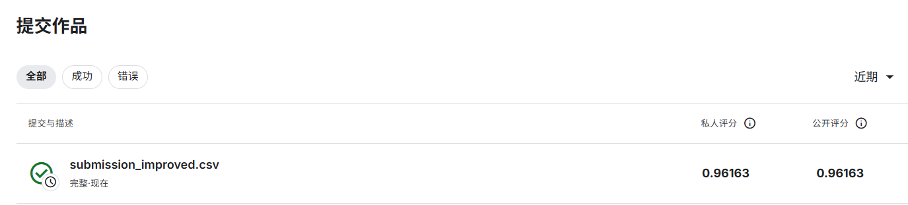

# GitHub 推送指南

## 当前状态

✅ **本地提交已完成**
- 提交哈希：`521c757`
- 提交信息：feat: 更新实验成绩和集成模型，Public Score 0.96163，添加 Kaggle 截图和完整代码
- 包含文件：
  - README.md (含 Kaggle 截图引用)
  - images/kaggle_score.png (Kaggle 成绩截图)
  - submission/submission_improved.csv (改进版提交文件)
  - code/*.py (所有模型代码)
  - results/*.csv (统计信息)

## 推送方法

### 方法 1: 使用 Git Bash (推荐)

1. **打开 Git Bash**
   ```bash
   # 在开始菜单搜索 "Git Bash" 并打开
   ```

2. **进入项目目录**
   ```bash
   cd "d:/kaggle 词袋遇到/word2vec-nlp-tutorial"
   ```

3. **推送更改**
   ```bash
   git push
   ```

4. **输入 GitHub 凭据**
   - 用户名：yuan-linyang
   - 密码/Token: (你的 GitHub 密码或个人访问令牌)

### 方法 2: 使用 GitHub Desktop

1. **打开 GitHub Desktop**
2. **添加本地仓库**
   - File → Add Local Repository
   - 选择：`d:\kaggle 词袋遇到\word2vec-nlp-tutorial`
3. **提交更改**
   - 在 Changes 标签页查看更改
   - 输入提交信息：`feat: 更新实验成绩和集成模型，Public Score 0.96163`
   - 点击 "Commit to main"
4. **推送更改**
   - 点击右上角 "Push origin"

### 方法 3: 使用命令行 (需要配置凭据)

1. **配置 Git 凭据管理器**
   ```bash
   git config --global credential.helper manager
   ```

2. **清除旧凭据 (如果有)**
   ```bash
   git credential-manager erase
   ```

3. **再次推送**
   ```bash
   cd "d:\kaggle 词袋遇到\word2vec-nlp-tutorial"
   git push
   ```

### 方法 4: 手动上传 (临时方案)

如果以上方法都失败，可以：

1. **访问 GitHub 仓库**
   - https://github.com/yuan-linyang/112304260141_yuanlinyang

2. **上传文件**
   - 点击 "Add file" → "Upload files"
   - 选择要上传的文件
   - 输入提交信息
   - 点击 "Commit changes"

## 验证推送成功

推送完成后，访问:
https://github.com/yuan-linyang/112304260141_yuanlinyang

检查以下内容:
- ✅ README.md 显示最新成绩 (Public Score: 0.96163)
- ✅ Kaggle 截图正常显示
- ✅ 所有代码文件已更新

## 常见问题解决

### SSL 证书错误
```bash
git config --global http.sslVerify false
git push
```

### 认证失败
1. 生成 GitHub Personal Access Token
2. 使用 Token 代替密码

### 网络超时
- 检查网络连接
- 尝试使用手机热点
- 稍后再试

## 截图显示说明

README.md 中的截图路径:
```markdown

```

确保:
- ✅ images/kaggle_score.png 存在
- ✅ 文件已提交到 Git
- ✅ 推送成功

---

**创建时间**: 2026-04-16
**作者**: 袁琳洋
